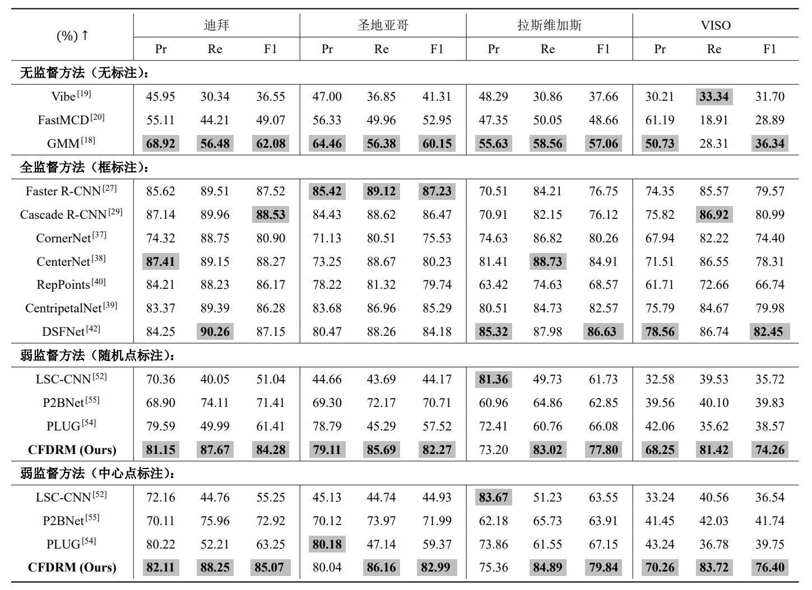

# CFDRM: Coarse-to-Fine Dynamic Refinement Model for Weakly Supervised Moving VehicleDetection in Satellite Videos
## PAPER
- ABSTRACT  
Deep learning methods have gradually developed
into the mainstream methods of moving vehicle detection in
satellite videos. However, these methods require labor-intensive and time-consuming box-level annotations to predict accurate locations and sizes, which is challenging for large-scale satellite video datasets with hundreds of vehicles. To address this problem, a novel coarse-to-fine dynamic refinement model (CFDRM) is proposed for moving vehicle detection in satellite videos only under the supervision of point-level annotations. CFDRM generates initial proposal boxes and performs spatio-guided matching with point annotations to obtain coarse box-level pseudo annotations. The initial priority of these coarse annotations is calculated by leveraging locally consistent prior tailored to satellite videos. Then, a dynamic refinement detector is constructed to transfer coarse annotations to fine annotations with prior and predictive collaborative curriculum refinement. During the curriculum learning (CL) process, the coarse annotations are sequentially learned with a certain priority, where the priority is inferred by considering the prior knowledge from the locally consistent prior and the knowledge itself from the predicted detector. Ultimately, a novel ambiguity-aware loss is designed to optimize the dynamic refinement detector from coarse annotations to fine annotations in an adaptively weighted fashion. Extensive experiments have been conducted on the Jilin-1 and SkySat satellite video datasets, thus demonstrating the superiority of CFDRM.
- [论文地址](https://ieeexplore.ieee.org/abstract/document/10535900)
- 实验结果

## CODE
- 环境需求  
    > pycocotools  
    > torch  
    > torchvision  
    > tensorboardX  
    > opencv  
    > progress

- 数据预处理
    - 伪标签生成  
        1. 更改`datas/point_bbox_new_2.py`中数据集的路径。  
        2. 运行```python datas/point_bbox_new_2.py```
    - 转换成coco格式  
        1. 更改`datas/pseudo_bbox2coco.py`中伪标签的路径。  
        2. 运行```python datas/point_bbox_new_2.py```
    - 数据集切分  
        根据数据集类型，对数据集进行划分和切割。例如SkySat数据集，运行```python datas/crop_frame_train_SkySat.py```
- 训练  
    > 训练参数详见`opts.py`
    - 普通训练（不更新标签）  
        ```python train.py```
    - 本文训练方法  
        ```python train_update.py```
